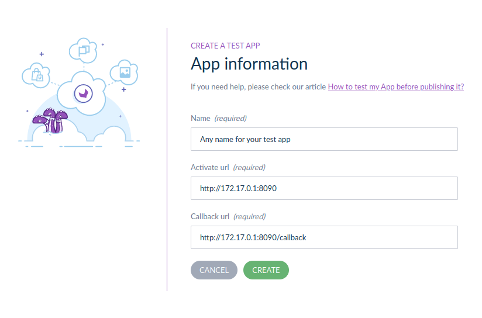

# demo-app

## Development

### Start the project in 3 steps

1) Create your local `.env` file
```shell
make .env
```
2) Edit the values in `.env`, if necessary
3) Start the development environment:
```shell
make up
```

4) If you are running a local PIM dev, check in your .env file that your AKENEO_PIM_URL=http://172.17.0.1:8080 (put your own port)
5) You need to expose your demo app to the internet. You can do it by running `ssh -R 80:localhost:8090 localhost.run`.
6) In Akeneo PIM, create a new test App from the connect/marketplace page and fill the form thanks to the URL the previous command gave you:


### Useful commands

```shell
make up # build & start the containers
make down # stop the containers
make destroy # remove all containers, all volumes, all docker images

make tests # launch all the tests

docker-compose run --rm app yarn watch # watch scss & js changes

docker-compose run --rm app bin/console [cmd] # execute a symfony command
docker-compose run --rm app composer [cmd] # execute a composer command
docker-compose run --rm app yarn [cmd] # execute a yarn command
```

## Production

build the docker image:
```shell
DOCKER_IMAGE_NAME=foo DOCKER_IMAGE_VERSION=latest make docker-image
```

launch apache+php on port 8080:
```shell
docker run -d -p 127.0.0.1:8080:8080/tcp foo:latest
```
